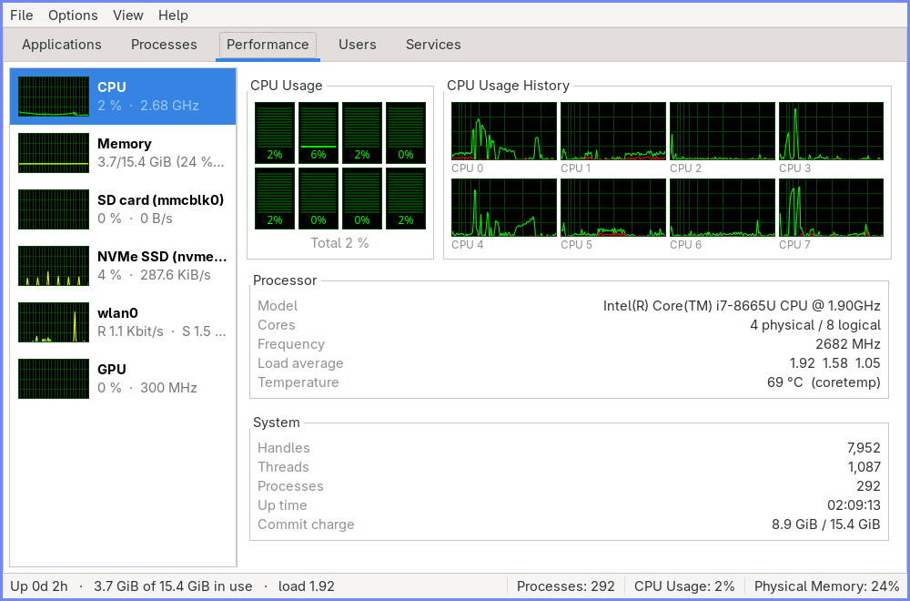
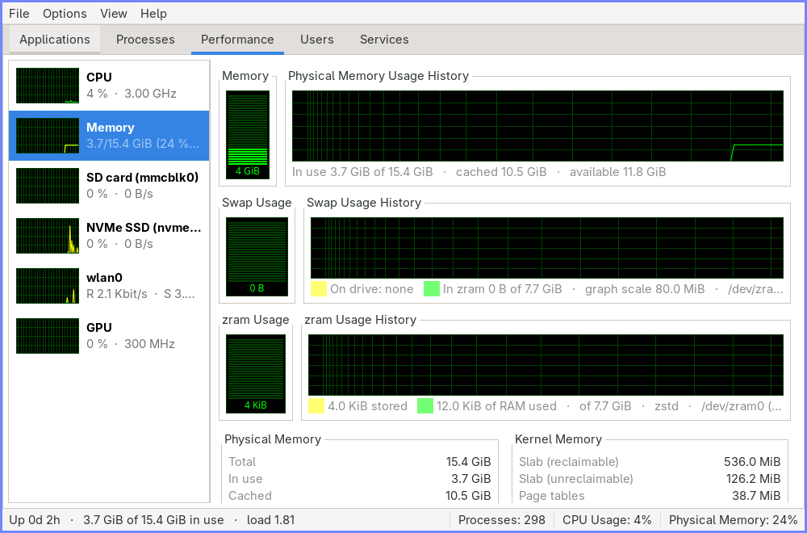
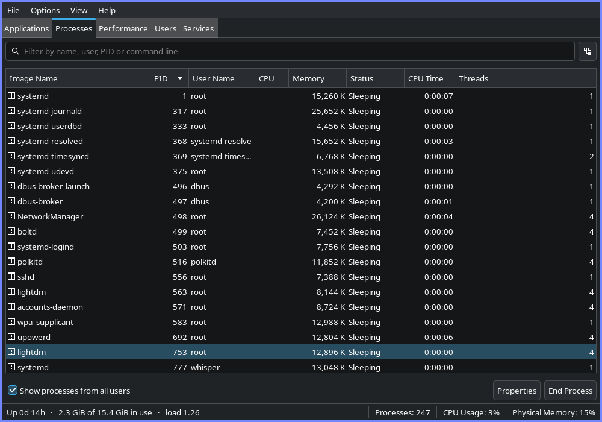
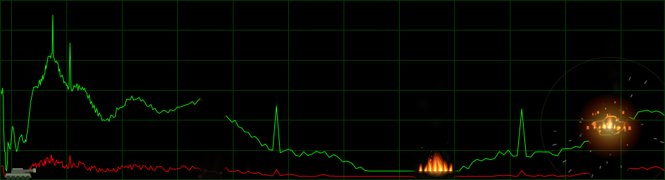

# Tanks Manager

A task manager for Linux desktops, shaped like the Windows XP / Windows 7
Task Manager but with the features and usability of a modern one.

Built with **GTK 3 + PyGObject**, the same toolkit as Thunar, so it uses your
GTK theme, your icon theme and your font settings with nothing hardcoded — it
looks native next to the rest of your desktop on every machine you put it on.

## Screenshots

### Performance — CPU

A segmented meter and a history graph for every logical processor, drawn as a
1px trace on the plate the way XP drew it, with kernel time in red beneath the
green total.



### Performance — Memory, swap and zram

Physical memory, swap and zram each get their own meter and history. Swap is
stacked by where the pages actually go, so drive-backed and zram-backed swap
are never confused for each other.



### Processes

Live filter, optional process tree, selectable columns, priorities, signals,
CPU affinity and a full properties window.



### Tank Mode

`Options ▸ Tank Mode` parks a tank on the baseline of every graph. Click the
plate and it lays the barrel onto that point and puts a round through it —
muzzle flash, a shell on a ballistic arc, an airburst, and a stretch of the
trace blown away and left burning until it goes out.

The chart is treated as terrain, so a round aimed at empty sky still comes
down on the line. The damage belongs to the samples it landed on rather than
to a place on the plate: holes and scorching travel left with the readings
that were under them and scroll off the edge with them. The data itself is
never altered — the trace is simply not drawn across a stretch that has been
blown away.

It is deliberately not remembered between runs: every session starts with it
off, however you left it. `tanksmanager --tank-mode` arms it for one session
without touching the menu.

Below, the CPU history graph with three rounds in it: an old one on the left
that has burnt out and drifted, one still burning in the middle, and one just
landed on the right.



## Requirements

| Distro | Packages |
| --- | --- |
| Arch | `python-gobject gtk3 python-psutil` |
| Debian/Ubuntu | `python3-gi gir1.2-gtk-3.0 python3-psutil` |
| Fedora | `python3-gobject gtk3 python3-psutil` |

Python 3.10 or newer.

Optional: `systemctl` for the Services tab, `wmctrl` for the Applications tab
on X11 window managers other than i3.

## Running

```sh
./run.sh                    # straight from the source tree
./run.sh --tab performance  # applications, processes, performance, users, services
./run.sh --tank-mode        # arm Tank Mode for this session
./install.sh                # install into ~/.local (no root needed)
sudo ./install.sh /usr/local
```

`install.sh` also puts the icon, the desktop entry and the AppStream metadata
where your desktop expects to find them. There is a `pyproject.toml` as well,
so `pip install .` works — but install PyGObject from your package manager
first, because pip would otherwise try to build it against GTK headers most
systems do not have:

```sh
pip install --user .        # after python-gobject is installed system-wide
```

## Tabs

| Tab | What it shows |
| --- | --- |
| **Applications** | Open windows, with Switch To / End Task / New Task, plus Go To Process |
| **Processes** | Every process, live filter, optional process tree, priorities, signals, affinity, properties |
| **Performance** | Windows 10 style card strip — CPU, Memory, one card per drive, per network adapter and per GPU — each with a live sparkline and its own detail pane |
| **Users** | Who is logged in, what each user costs in CPU and memory, log off |
| **Services** | systemd units, system and user scope, start/stop/restart/enable, status output |

## The XP look

The Performance tab reproduces the original rather than approximating it. The
palette was sampled pixel-by-pixel from a screenshot of the real Windows XP
Task Manager:

| Element | Colour |
| --- | --- |
| Plate | `#000000` |
| Unlit segments, grid | `#004000` |
| User time | `#00FF00` |
| Kernel time | `#FF0000` |
| Page file / swap history | `#FFFF00` |

The meters match the original's geometry too: 2px lit bars separated by a 1px
gap, **every** segment painted — dark green when unlit, not black — and the
reading printed in green inside the plate under the bar.

The history graphs are drawn the same way: a 1px trace on the plate with the
grid showing through underneath, not a block of colour with a line on top.
With `View ▸ Show Kernel Times` on you get exactly what XP gave you — a green
line for the total and a red one for kernel time beneath it. Turning the
classic palette off swaps in the theme's accent colour and a soft wash under
the trace, which is the modern alternative rather than the same drawing in
different colours.

### The time axis is not linear

This is the one place the original is deliberately left behind. XP gave every
second the same width, which meant a graph could only ever hold as much
history as it had pixels — about two minutes.

Here the **newest half of the history fills the right half of the plate at
exactly that resolution**, and everything older is folded into the left half
by an exponential that starts at the same scale and tightens from there. The
slope matches at the join, so there is no seam to see; the graph simply gets
denser the further left you look, and holds around **seven times the history
in the same box**.

Two things follow from it:

* **Vertical grid lines are drawn through the same axis**, at a fixed number
  of samples rather than a fixed number of pixels, so they compress towards
  the left exactly as the readings do. That is what shows you the scale
  changing instead of hiding it. Because the axis is exponential out there,
  a fixed number of samples between lines makes their spacing shrink by a
  constant ratio — a smooth accelerating squeeze rather than a pattern with
  pieces missing — and they stop once they would be closer together than
  three pixels.
* **Where several readings share a pixel, the column is their mean.** Drawing
  them all would be a smear that flickers as it scrolls; averaging turns an
  old spike into part of the trend it belonged to, which is the point of
  looking that far back.

The card sparklines stay linear — at 78 pixels wide there is nothing to gain.

* **One meter per logical processor.** A multiprocessor XP box drew a separate
  bar for every CPU, and so does this.
* **One graph per CPU** by default. `View ▸ CPU History` switches between
  *One Graph, All CPUs* and *One Graph Per CPU*, as in the original.
* **`View ▸ Show Kernel Times`** draws red kernel time beneath the green
  total, in both the graphs and the meters.

## The Performance cards

Navigation follows Windows 10: a strip of live cards down the left, a detail
pane on the right. The cards are built from the hardware actually present, so
the strip on your machine is not the strip on anyone else's.

| Card | Detail pane |
| --- | --- |
| **CPU** | A segmented meter and history graph per logical processor, kernel/user split, processor and system read-outs |
| **Memory** | Physical memory, swap and zram rows plus the memory read-outs (see below) |
| **Drive** — one per physical disk | Active time, transfer rate, model, capacity, IOPS, average response time, and the volumes mounted from it |
| **Network** — one per adapter | Send/receive throughput, link speed, duplex, address, totals |
| **GPU** — one per adapter | Utilisation, a graph per engine (3D, Copy, Video Decode, Video Encode), clock, memory, open clients |

Only real hardware is listed as a drive: a `/sys/block` entry counts when it has
a `device` symlink, which excludes loop, zram and device-mapper nodes. Loopback
is left out of the network cards. Every pane keeps its history running even
while another card is selected, so switching never reveals an empty graph.

### Hotplug

Drives, network adapters and GPUs are re-detected on every sample, so plugging
something in or pulling it out adds or removes its card on the next tick —
no restart, no refresh. Re-detection costs about 0.1 ms, which is why there is
no caching to go stale.

A card reader reporting zero sectors is treated as absent, so **inserting and
ejecting media** behaves exactly like plugging a drive in and out. If the drive
you are currently looking at is removed, the view falls back to CPU; if you
then pick another card yourself, a later replug leaves you where you are rather
than dragging you back.

### Where the GPU numbers come from

Linux has no single source, so three are tried in order and the pane tells you
which one answered:

1. `device/gpu_busy_percent` — amdgpu exposes it directly, no root needed
2. **DRM `fdinfo`** — i915, xe, amdgpu, panfrost and friends publish per-engine
   busy nanoseconds for every open client; a full scan of `/proc` costs about
   7 ms, so it runs on every sample
3. `nvidia-smi` — the proprietary stack

The fdinfo route can only read processes this user is allowed to inspect, which
on a desktop is the interesting ones. The pane says so rather than pretending
the number is machine-wide.

## Memory, swap and zram

Memory, swap and zram each get their own meter-and-history row, in the shape XP
used for *PF Usage*. The swap and zram rows only appear on machines that have
them, and they are kept clearly apart because they measure different things:

* **Swap Usage** — how full your swap *space* is, stacked by where the pages
  actually go: yellow for swap on a drive (partition or file), green for swap
  backed by zram. The legend names every device with its type and priority, so
  there is never a question which is which.
* **zram Usage** — the zram block device itself: how much uncompressed data it
  is holding, how much RAM that actually costs, the compression algorithm, and
  what the device is used for (swap, or a mount point).

Because a swap device is normally a sliver of a very large capacity, the two
history graphs autoscale against the largest amount seen rather than against
the device size — otherwise they would sit flat on zero forever. The scale is
printed in the legend. The meters stay as a share of capacity, the way the
original read.

### If the numbers look contradictory

`/proc/swaps` can report hundreds of megabytes in use while zram reports almost
nothing stored. Both are right: **zswap** sits in front of the swap devices and
holds compressed pages in its own RAM pool, only writing through to the device
below on overflow. Where zswap is active, the zram legend says so and the
**Compressed Memory** read-out box breaks out zram stored / zram in RAM / zram
saving alongside the zswap pool size and what it holds.

`Options ▸ Classic Graph Colours` turns the retro palette off, and the graphs
then derive their colours from your GTK theme's accent colour instead — useful
if you want them to blend into a light theme. Everything else in the window is
always themed; only the graph plates are deliberately retro.

## What is new compared to the original

* Live filter box (`Ctrl+F`) matching name, user, PID, systemd unit and command line
* Process tree view, so children stay under the thing that started them
* Kernel threads hidden by default (`View ▸ Show Kernel Threads`)
* Per-process disk read/write rates, CPU time, terminal, command line
* Full signal menu, not just "End Process" — including Stop and Continue
* CPU affinity editor
* A properties window with memory breakdown, open files, sockets, threads, memory maps and environment
* A **GPU** column showing what share of the busiest engine each process is using,
  which even the Windows original only manages per-adapter
* A **Unit** column naming the systemd service or scope a process belongs to —
  usually a better answer to "what is this thing" than the parent PID
* Export the process list to CSV, or copy it to the clipboard, exactly as it
  appears on screen
* A Windows 10 style card strip on the Performance tab, per drive / adapter / GPU,
  which replaces the separate Networking and Disks tabs entirely
* GPU utilisation with a per-engine breakdown, from DRM fdinfo where no driver counter exists
* Per-drive active time, IOPS and average response time
* Temperatures and load average
* Swap broken down by backing store, zram device statistics and zswap accounting
* systemd services for both the system manager and your user session
* Column layout, sort order, window size and options remembered between runs
* A non-linear time axis: the recent half at full resolution, older readings
  folded into the left half, so a graph holds roughly seven times the history
  in the same box
* An **Ultra** refresh speed, ten samples a second
* Tank Mode, for when a chart deserves it — damage scrolls away with the data,
  off at every start, never saved

## Refresh speed

`View ▸ Update Speed` offers **Ultra**, High, Normal, Low and Paused —
ten, two, one and a quarter samples a second, and nothing at all.

Ultra reads every process ten times a second, which costs about half of one
core on a machine with 300 processes, and shrinks what a graph covers to
under a minute. It is there for watching something short and sharp, not for
leaving on.

Two things had to change to make it real:

* **The two expensive readings now keep their own pace.** Reading every hwmon
  sensor takes about 39 ms and the walk of `/proc/*/fdinfo` the GPU needs
  where no driver counter exists takes about 22 ms — together, more than an
  Ultra tick has to spend. Neither moves meaningfully in a tenth of a second,
  so temperatures refresh every two seconds and the GPU scan twice a second,
  never both on the same tick. A system pass went from 69 ms to 3 ms, which
  every speed benefits from.
* **The worker waits out what is left of the interval**, not the whole of it.
  It used to sample and *then* wait the full period, so every speed ran slow:
  High was 1.80 Hz rather than 2, and Ultra managed 6.8 Hz rather than 10.
  All of them now hit their target.

## Keyboard

| Key | Action |
| --- | --- |
| `F5` | Refresh now |
| `Ctrl+F` | Jump to Processes and focus the filter |
| `Ctrl+N` | New Task (Run...) |
| `Delete` | End the selected process |
| `Escape` | Clear the filter |
| `Ctrl+Q` | Quit |

## Notes for Wayland

* Wayland has no protocol that lets an ordinary application enumerate other
  windows, so the **Applications** tab has to ask the compositor directly. It
  speaks sway and i3 over their IPC socket, Hyprland through `hyprctl` and
  niri through `niri msg` — none of which costs a dependency, since each
  ships with its compositor. On X11, install `wmctrl`. Anywhere else the tab
  says so plainly and every other tab keeps working.
* `Options ▸ Always On Top` is disabled on Wayland — stacking is the
  compositor's decision there. Use your WM's own binding, e.g. for sway:

  ```
  for_window [app_id="de.synthelicz.TanksManager"] floating enable, resize set 1000 760
  bindsym Ctrl+Shift+Escape exec tanksmanager
  ```

## Layout

```
tanksmanager/
├── app.py                 GtkApplication, command line
├── backend/               everything that touches /proc, no GTK
│   ├── sampler.py         worker thread, process and system snapshots
│   ├── actions.py         kill, nice, affinity, run
│   ├── drives.py          per-physical-drive statistics
│   ├── gpu.py             GPU utilisation (sysfs, DRM fdinfo, nvidia-smi)
│   ├── services.py        systemd
│   ├── users.py           logind sessions
│   ├── windows.py         sway/i3, Hyprland, niri and wmctrl window lists
│   ├── icons.py           .desktop -> icon theme lookups
│   ├── units.py           human formatting
│   └── config.py          ~/.config/tanksmanager/config.json
└── ui/                    one module per tab
    ├── window.py          menu bar, notebook, status bar
    ├── graph.py           Cairo graphs and meters
    ├── table.py           keyed list view shared by the table tabs
    ├── perfcards.py       the Performance card strip
    ├── perfpanes.py       one detail pane per card
    ├── tankmode.py        Tank Mode: shells, craters and fire
    └── processes.py …     the tabs
```

Sampling runs on a worker thread and hands immutable snapshots to the GTK main
loop, so the interface never blocks on `/proc`. Rows are matched on PID and
updated in place, which is why selection and scroll position survive the
once-a-second refresh.

## Tests

```sh
pip install pytest
python -m pytest             # parser tests: no GTK, no display, no hardware
python tests/smoke_gui.py    # builds the real window; needs a display
```

The parser tests point the sysfs and procfs readers at fake directory trees
built in a temp directory, so swap layouts, zram configurations, cgroup
formats, drive hotplug and DRM fdinfo counters can all be tested on a machine
that has none of them. `smoke_gui.py` builds the whole window, visits every
tab, fires a round in Tank Mode and shuts down again — it is what catches the
construction-order mistakes a parser test never could. Both run in CI, along
with a wheel build and validation of the desktop entry and AppStream data.

## Licence

GPL-3.0-or-later. See [LICENSE](LICENSE).
